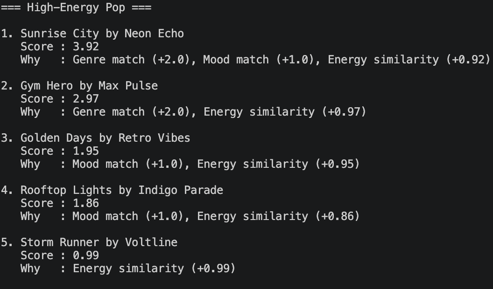
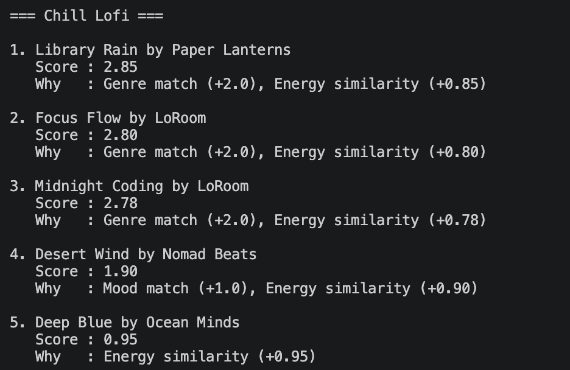

# 🎵 Music Recommender Simulation

## Project Summary

In this project you will build and explain a small music recommender system.

Your goal is to:

- Represent songs and a user "taste profile" as data
- Design a scoring rule that turns that data into recommendations
- Evaluate what your system gets right and wrong
- Reflect on how this mirrors real world AI recommenders

This project builds a simple content-based music recommender system. It takes a user’s preferences like genre, mood, and energy level, and compares them with a dataset of songs. Each song is given a score based on how closely it matches the user’s taste, and the system recommends the highest scoring songs. The goal is to simulate how real-world platforms like Spotify suggest music using structured data and ranking logic.

---

## How The System Works

This recommender system uses a **content-based filtering approach**, meaning it recommends songs by comparing song features directly with a user’s preferences.

### Features Used

Each song contains:
- Genre (e.g., pop, rock, lofi)
- Mood (e.g., happy, sad, chill)
- Energy (a value between 0.0 and 1.0)
- Tempo (beats per minute)

The user profile includes:
- Preferred genre
- Preferred mood
- Target energy level

### Scoring Logic

Each song is given a score based on:

- +1.0 point if the genre matches the user’s preference
- +1.0 point if the mood matches
- + 2 × (1 - energy difference) to strongly reward songs with similar energy levels

Songs closer to the user’s energy preference receive higher scores. Because of the increased weight, energy similarity plays the biggest role in ranking songs.

### Recommendation Process

1. The system loads all songs from the dataset
2. Each song is scored individually using the scoring logic
3. Songs are sorted from highest to lowest score
4. The top K songs are recommended to the user

### Potential Bias

This system may over-prioritize genre and repeatedly recommend similar songs, creating a “filter bubble.” It may also ignore good matches in mood or energy if the genre does not match.

### System Flow


### User Profile Design

The user profile is defined as:

- Genre: pop  
- Mood: happy  
- Energy: 0.8  

This profile represents a user who prefers upbeat, energetic music.

This combination allows the system to differentiate between different styles. For example:
- "Intense rock" songs may match energy but not genre
- "Chill lofi" songs may match mood but not energy

Because multiple features are used together, the recommender can distinguish between different types of music rather than treating all songs as similar.

---

## Getting Started

### Setup

1. Create a virtual environment (optional but recommended):

   ```bash
   python -m venv .venv
   source .venv/bin/activate      # Mac or Linux
   .venv\Scripts\activate         # Windows

2. Install dependencies

```bash
pip install -r requirements.txt
```

3. Run the app:

```bash
python -m src.main
```

### Running Tests

Run the starter tests with:

```bash
pytest
```

You can add more tests in `tests/test_recommender.py`.

---

## Experiments You Tried

### Weight Shift Experiment

I changed the scoring by reducing the genre weight from 2.0 to 1.0 and doubling the energy similarity.

After running the system again, I noticed that energy had a much bigger impact on the rankings. Songs with similar energy levels started appearing higher even if the genre did not match.

Because of this, the recommendations became more diverse, but sometimes less accurate for users with strong genre preferences. For example, some songs ranked high mainly because of energy similarity, even though they did not match the genre.

This shows that increasing energy weight makes the system more flexible, but reducing genre weight can reduce precision.

### System Evaluation

I tested the recommender system using multiple user profiles, including both normal and edge cases:

- High-Energy Pop (clear strong preferences)
- Chill Lofi (low energy, relaxed mood)
- Deep Intense Rock (high energy, intense mood)
- Conflicting Mood (high energy + sad mood)
- No Preference (no genre or mood specified)

#### Observations

- The system performs well when user preferences are clear and aligned (e.g., High-Energy Pop).
- In conflicting cases, the system ignores mismatches and only rewards matches, which can lead to less accurate recommendations.
- When no preferences are provided, the system relies mostly on energy similarity, resulting in more generic recommendations.
- The model does not penalize incorrect matches, which limits its ability to distinguish poor fits.

#### Accuracy and Surprises

For the "High-Energy Pop" profile, the recommendations felt accurate because the top songs matched both genre and energy closely. Songs like "Sunrise City" ranked highly because of strong alignment with all features.

One surprise was that in some cases, songs with only energy similarity still ranked in the top 5. This shows that energy plays a strong role even when genre or mood do not match.

Additionally, the same songs appeared across multiple profiles, which shows that the dataset is small and that certain features (like energy similarity) dominate the scoring.

After asking Claude why "Sunrise City" ranked #1 for the High-Energy Pop profile, it answered that this happened because it matched all the important features. The genre is pop, which matches the user preference, so it gets +2.0. The mood is also happy, which matches again and adds +1.0. On top of that, the energy level (0.82) is very close to the user’s preference (0.9), so it gets a high energy similarity score of +0.92.

Because of this, its total score becomes 3.92, which is higher than all the other songs.

Other songs didn’t match as well. For example, "Gym Hero" matches the genre and has similar energy, but its mood is different, because of which it doesn’t get the extra +1.0. That is why its total score is lower (2.97).

So overall, songs that match all features clearly rank higher, which is why "Sunrise City" comes out on top.


#### Example Outputs

Screenshots of terminal outputs for each profile are included below:

  
  
  
  
  


---

## Limitations and Risks


---

## Reflection

Read and complete `model_card.md`:

[**Model Card**](model_card.md)

Write 1 to 2 paragraphs here about what you learned:

- about how recommenders turn data into predictions
- about where bias or unfairness could show up in systems like this


---

## 7. `model_card_template.md`

Combines reflection and model card framing from the Module 3 guidance. :contentReference[oaicite:2]{index=2}  

```markdown
# 🎧 Model Card - Music Recommender Simulation

## 1. Model Name

Give your recommender a name, for example:

> VibeFinder 1.0

---

## 2. Intended Use

- What is this system trying to do
- Who is it for

Example:

> This model suggests 3 to 5 songs from a small catalog based on a user's preferred genre, mood, and energy level. It is for classroom exploration only, not for real users.

---

## 3. How It Works (Short Explanation)

Describe your scoring logic in plain language.

- What features of each song does it consider
- What information about the user does it use
- How does it turn those into a number

Try to avoid code in this section, treat it like an explanation to a non programmer.


## CLI Output Example

Here is an example of the recommender system running in the terminal:


---

## 4. Data

Describe your dataset.

- How many songs are in `data/songs.csv`
- Did you add or remove any songs
- What kinds of genres or moods are represented
- Whose taste does this data mostly reflect

---

## 5. Strengths

Where does your recommender work well

You can think about:
- Situations where the top results "felt right"
- Particular user profiles it served well
- Simplicity or transparency benefits

---

## 6. Limitations and Bias

The system is biased toward energy because energy has the biggest weight in the scoring. Because of this, songs with similar energy keep showing up even if the genre or mood does not match well.

Also, some users are not handled properly. For example, if a user chooses a mood like "sad" but there are no songs with that mood in the dataset, then the system just ignores mood completely.

Another issue is that the dataset is very small, so the same songs appear again and again. This creates a filter bubble where users don’t get much variety in recommendations.

---

## 7. Evaluation

I tested the system using different user profiles like High-Energy Pop, Chill Lofi, Deep Intense Rock, Conflicting Mood, and No Preference.

I noticed that when the preferences are clear, the results look correct. For example, High-Energy Pop gives songs that are upbeat and energetic.

One surprising thing was that some songs showed up in multiple profiles. This happens because energy has a strong influence, so songs with similar energy keep ranking high even if other features don’t match.

Also, when the user has no preference or conflicting preferences, the system mostly depends on energy, which makes the recommendations less meaningful.

---

## 8. Future Work

If you had more time, how would you improve this recommender

Examples:

- Add support for multiple users and "group vibe" recommendations
- Balance diversity of songs instead of always picking the closest match
- Use more features, like tempo ranges or lyric themes

---

## 9. Personal Reflection

A few sentences about what you learned:

- What surprised you about how your system behaved
- How did building this change how you think about real music recommenders
- Where do you think human judgment still matters, even if the model seems "smart"

